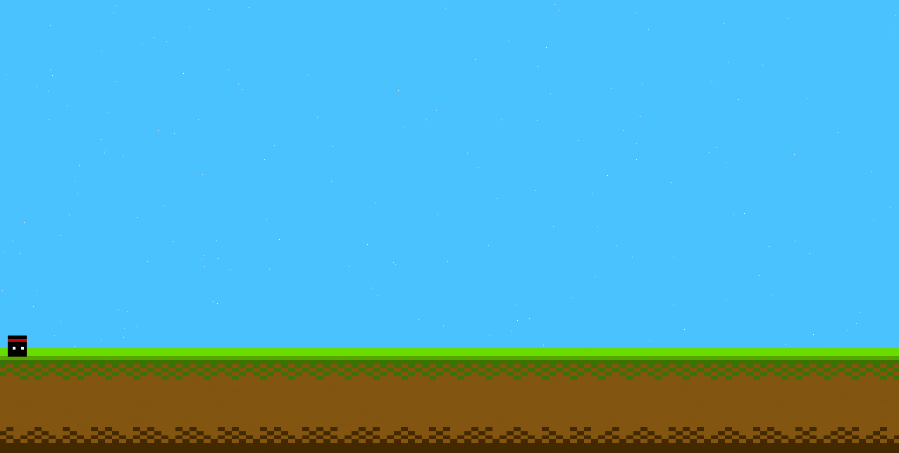

# 🎮 Jogo 2D 



Um jogo 2D simples feito com **Raylib** e **C#**.

## ▶️ Como Rodar

1. Tenha o [.NET SDK](https://dotnet.microsoft.com/download) instalado
2. Baixe ou clone o projeto
3. Na pasta do projeto, execute:
```bash
dotnet run
```

## 🎮 Controles
- **Setas ou WASD**: Mover
- **Espaço**: Pular
- **ESC**: Sair

## 🛠️ Tecnologias
- Raylib (biblioteca de jogos)
- C# (.NET)
- Visual Studio / VS Code

## 📝 Sobre
Protótipo criado para aprender desenvolvimento de jogos 2D.

---
*Feito com Raylib e C#*
